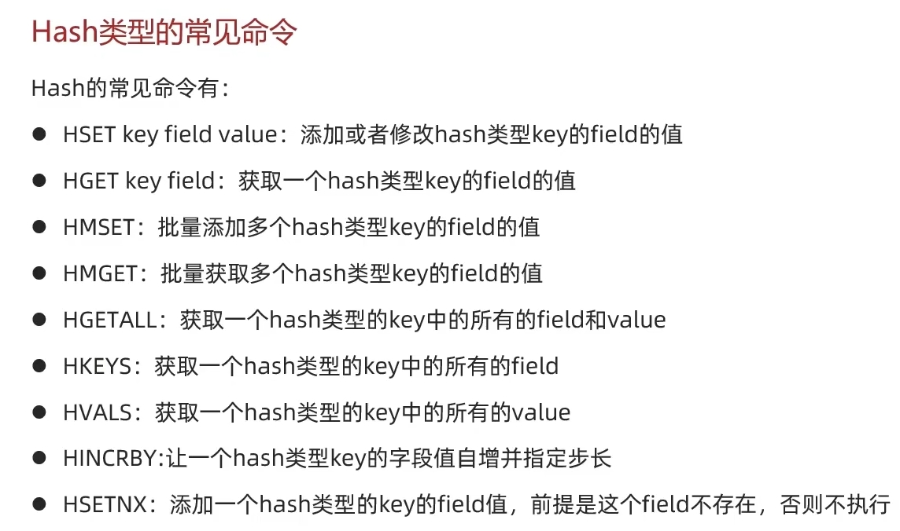

## Day12



### List

可以看做是双向链表结构

1. 有序
2. 可以重复元素
3. 插入删除快
4. 查询速度一般


Block阻塞式获取

### Set

类似于hashset

1. 无序

2. 元素不可重复

3. 查找快

4. 支持交集、并集、差集等功能

   ```java
   SADD KEY MEMBER
   SREM KEY MEMBER
   SCARD KEY 计数
   SISMEMBER KEY MEMBER
   SMEMBERS
   
   SINTER KEY1 KEY2 交集
   SDIFF KEY1 KEY2 差集
   SUNION KEY1 KEY2 并集
   ```

 SortedSet

每个元素自带一个score，基于score排序，底层存储是跳表加上哈希表

1. 可排序

2. 元素不重复

3. 查询速度快

   ```java
   ZADD KEY SCORE MEMBER
   ZREM KEY MEMBER
   ZSCORE KEY MEMBER
   ZRANK KEY MEMBER
   ZCARD KEY
   ZCOUNT KEY MIN MAX 得分内
   ZINCRBY KEY INCREMENT MEMBER
   ZRANGE KEY MIN MAX 排名范围内
   ZRANGEBYSCORE KEY MIN MAX
   ZDIFF\ZINTER\ZUNION
   降序在Z后面加上REV 例如ZREVRANK
   ```


Redis Java客户端

1. Jedis线程不安全，多线程需要线程池，学习成本低

2. lettuce基于netty，支持同步、异步、响应式编程，线程安全，支持哨兵模式、集群模式和管道模式，Spring默认

3. Redisson分布式javba数据结构集合

   

### RedisTemplate

