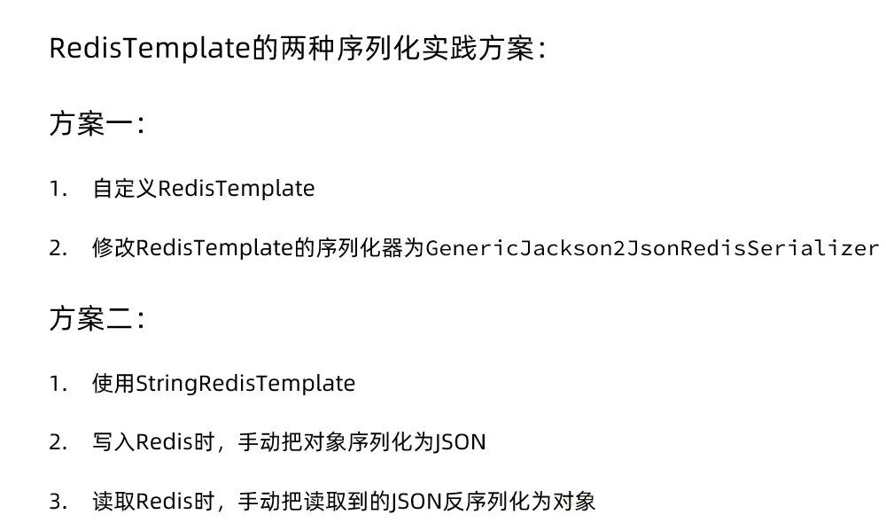

## Day13

### redisTemplate

1. 引入以来
2. 配置redis信息
3. 注入redisTemplate并使用

默认序列化器

缺点：

1. 可读性差
2. 内存占用大

设置自己的序列化器：

1. 创建配置类
2. 传入所需序列化器
3. Value使用Jackson2Json
4. key使用redisString
5. 设置对应hash序列化
6. 返回Template

去除自带序列化的内容：

1. redis key value都使用String，使用stringRedisTemplate

2. 使用ObjectMapper序列化并反序列化

   