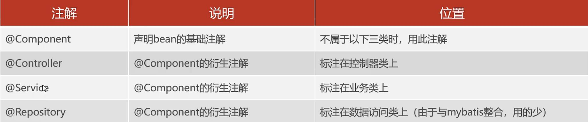
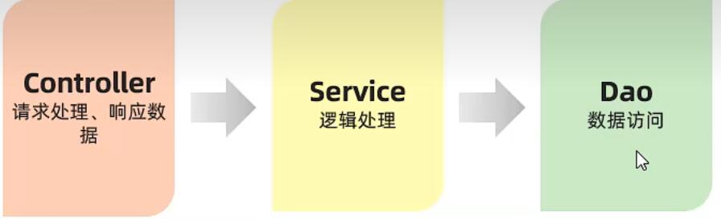
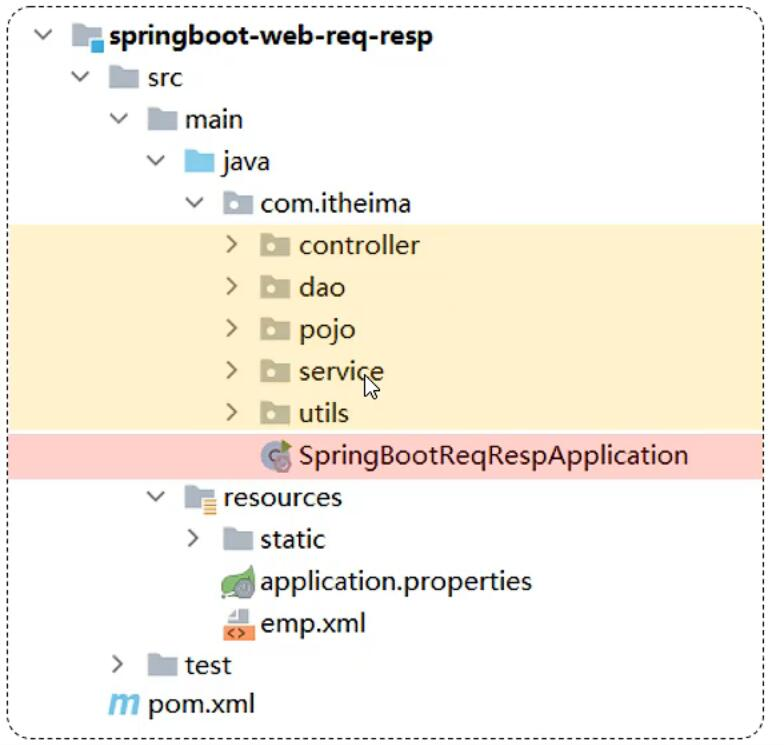

## Day2

IOC控制反转

对象创建权由程序自身转移到外部容器

DI依赖注入

容器为程序提供其所依赖的资源

Bean对象

@component及其三个子类

Idea

Acurator

@SpringbootApplication包含了@ComponentScan这个注解 默认扫描当前包和子包

@Autowired注解默认按照类型注入

多个相同类型Bean时：

@Primary

@Qualifier

@Resource 默认按名称注入