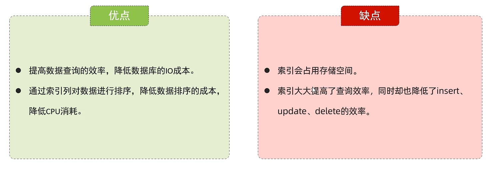
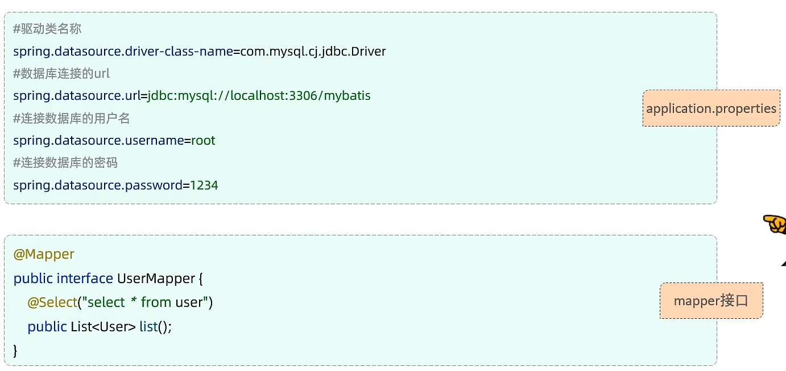
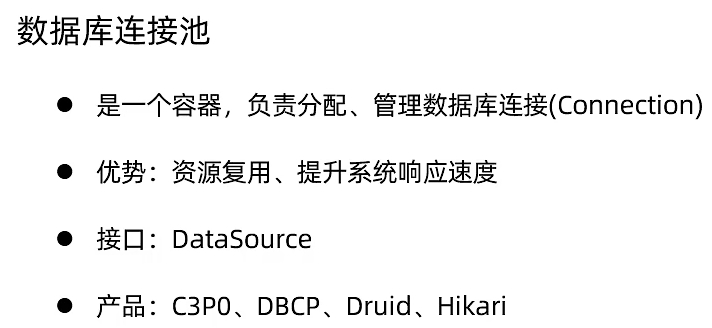

## Day3

### mysql索引

create index 名字 on 表名（列名）

索引是一种数据结构

全表扫描 性能极低

树形结构



默认B+树结构（多路平衡搜索树）

非叶子节点仅索引 所有key都在叶子结点中出现

叶子结点从小到大 双向链表

主键索引 唯一索引（唯一约束）

drop index 名字 on 表名


### MyBatis持久层框架

在配置文件中基础配置

注解定义/XML编写sql语句

```java
@Mapper

public interface UserMapper {

	@select ("select * from user")

	public List<User> list();

}
```

实体类中推荐使用包装类型

 

### 数据库连接池 容器

druid(alibaba开发)   hikari(springboot 默认)



Mybatis

#{}

```java
@Mapper
public interface EmpMapper {
	@Delete("delete from emp where id  = #{id}")
	public void delete(Integer   id);
}
```

@delete返回值为受影响的记录数