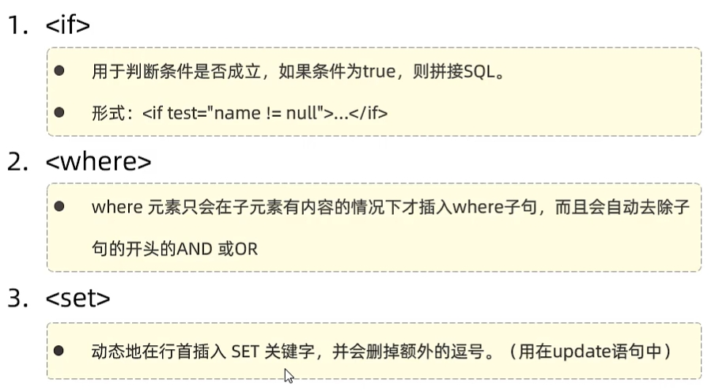
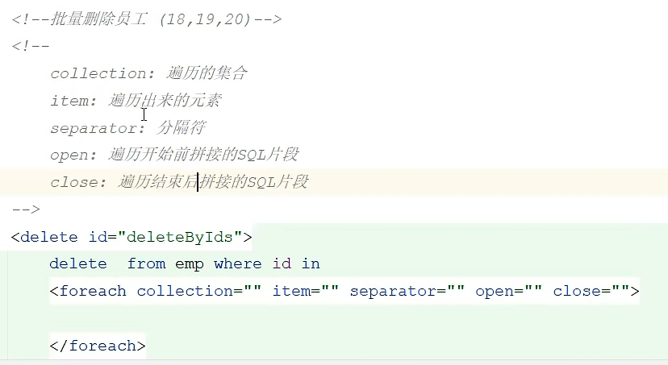

## Day4

预编译sql

性能更高、更安全（防止sql注入）

‘ or '1' = '1


#{}获得对象内容

注意实体类是驼峰命名 数据库是下划线命名


主键返回

```java
@Options(keyProperty = "id", useGeneratedKeys = true)
```

字段名和属性名不一致

1、起别名，让别名与实体类属性一致

2、@Results({@Result(column = "", property = "")})

3、打开自动映射开关 

mybatis.configuration.map-underscore-to-camel-case=true


concat mybatis字符串拼接函数 

XML映射文件三点规范


动态sql

```xml
<if test = ""> </if> 
<where> </where> 去除多余and或or
<set> <set>去除多余逗号
```

框架错误从下向上看






```xml
<sql> <include>
```


参数1：起始索引

参数2：查询返回记录数，每页展示记录数 

```sql
select * from emp limit 0, 5;
```


### PageHelper


