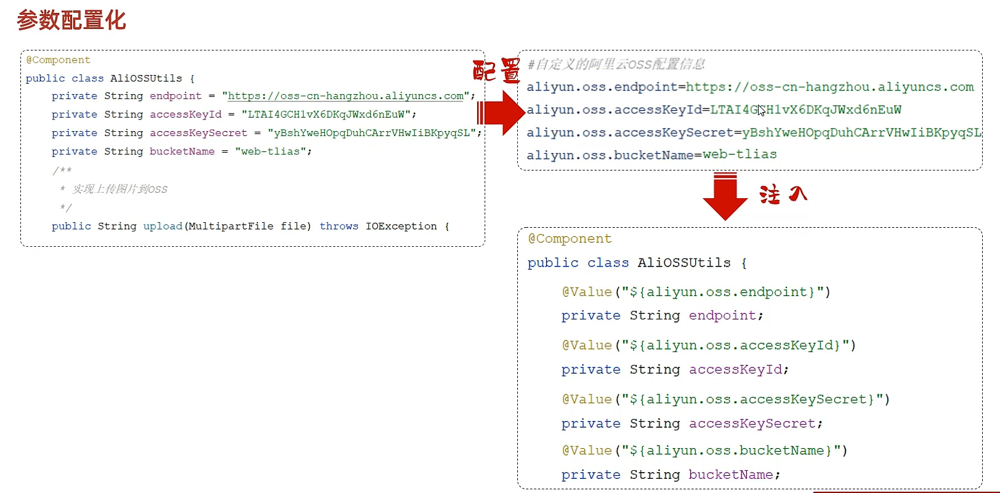
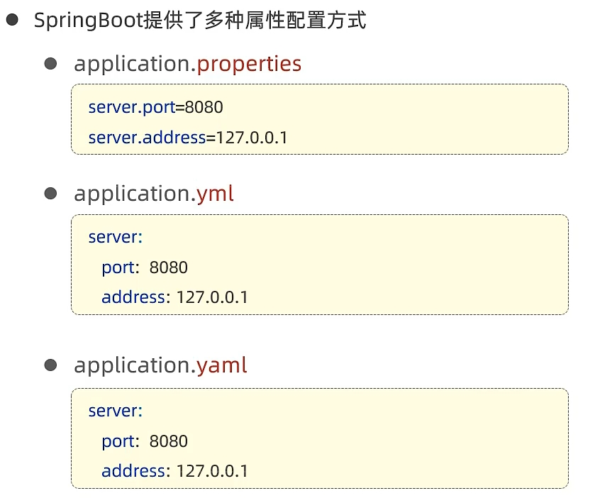
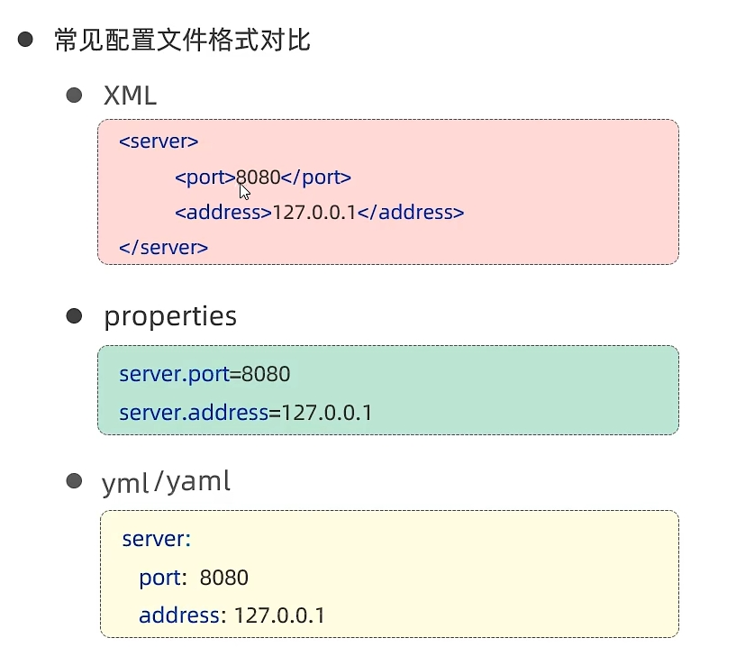
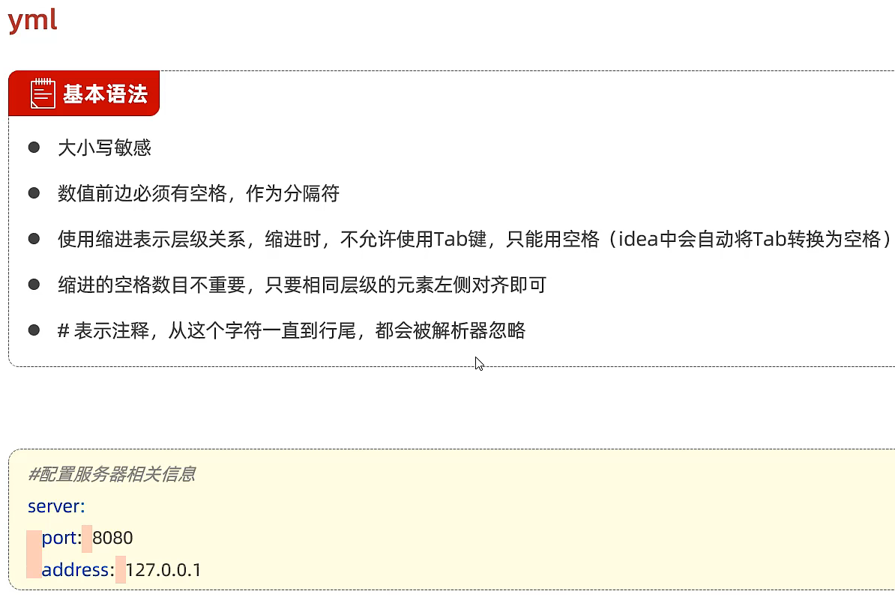

## Day5

application.properties

@Value("${配置文件中的key}")







推荐yml



```yml
#定义对象/Map集合
user:
  name: Tom
  age: 20
  adress: beijing
#定义数组/List/Set
hobby:
  - java
  - c
  - game
  - sport
```


```java
@Data
@Component
@ConfigurationProperties(prefix = "aliyun.oss")
```

