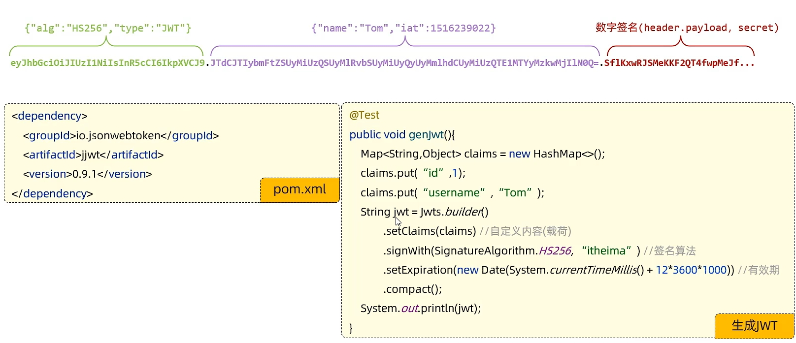

## Day6

### Session

底层基于cookie，cookie中的缺点都有

存储在服务器端，安全

多台服务器、分布式不可用

### 令牌技术

优点：支持pc、移动端

解决集群环境下认证问题

减轻服务器存储压力

缺点：需要自己实现


### JWT令牌

JSON Web Token

简洁、自包含、数字签名

组成：1、header

​		   2、Payload

​		   3、Signature


场景：登录认证

1、生成令牌

2、校验令牌

```java
String jwt = Jwts.builder()
    .signWith()
    .setClaims()
    .setExpiration()
    .compact();
```


```java
Claims claims = Jwts.parser()
    .setSigningKey()
    .parseCliamsJws()
    .getBody();
```




### 过滤器Filter


```java
chain.doFilter(request, response)
```

执行放行前逻辑

资源访问完成后还会回到Filter中

执行放行后逻辑

Filter拦截路径

```java
@WebFilter(urlPatterns = "/")
```

过滤器链

建立多个Filter类

优先级按照过滤器类名自然排序


### Interceptor

由Sping框架提供

动态拦截控制器方法的执行

1. 定义拦截器  实现HandlerInceptor接口

   1. preHandle
   2. postHandle
   3. afterCompletion

2. 注册配置拦截器

   ```java
   @Configuration
   public class WebConfig implements WebMvcConfigurer {
       public void addInterceptors(InterceptorRegistry registry) {
           registry.addInterceptor(自定义拦截器).addPathPatterns("/**");
       }
   }
   ```

   