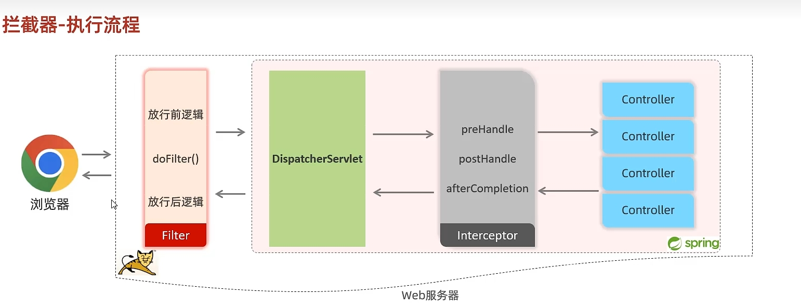
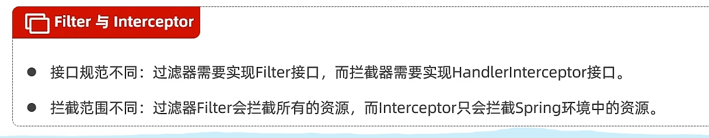
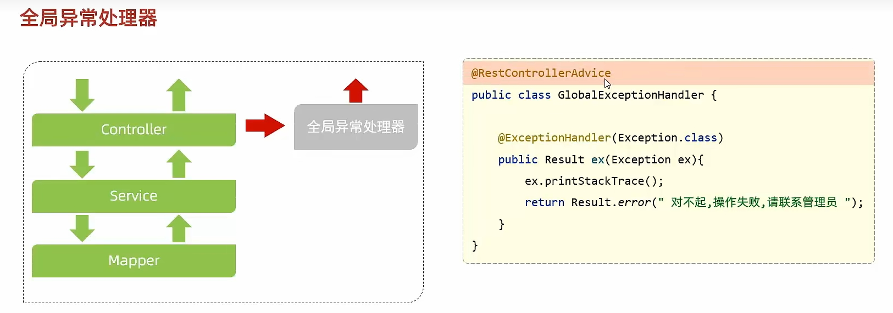
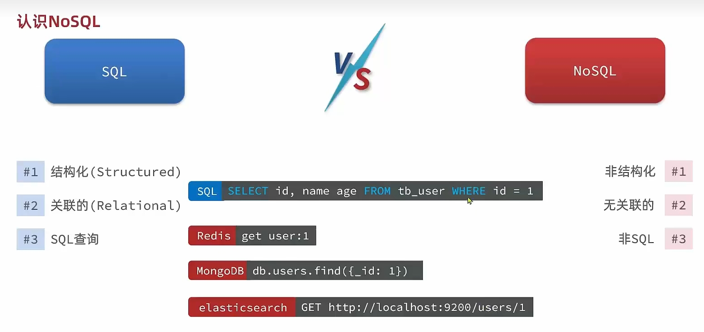
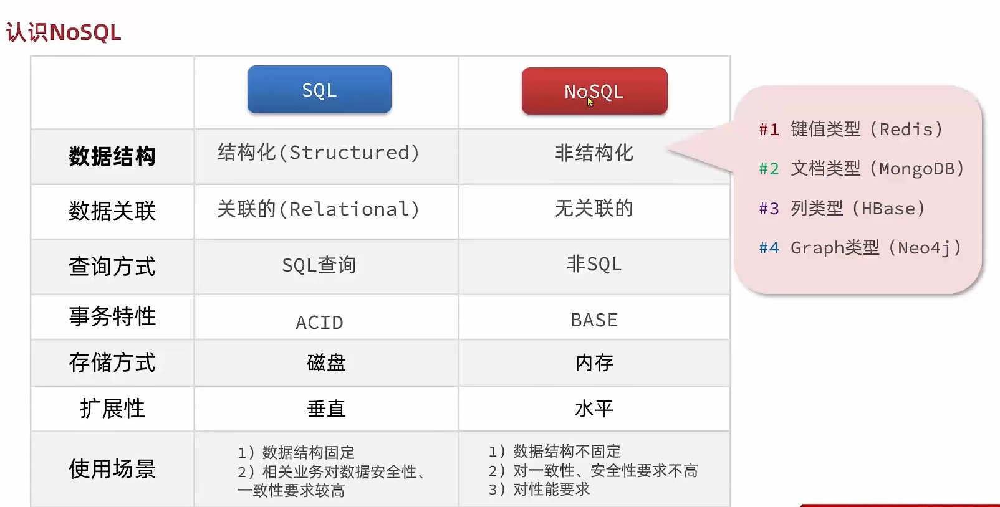

## Day7

### Interceptor

/*一级路径

/**任意级路径






### 异常处理

全局异常处理器



```java
@RestControllerAdvice
类
    @ExceptionHandler(Exception.class)
```


### Redis

### https://xiaolincoding.com/redis/base/redis_interview.html

https://www.bilibili.com/video/BV1cr4y1671t

NoSQL

1. 非结构化
2. 无关联的
3. 非SQL
4. BASE非ACID





 